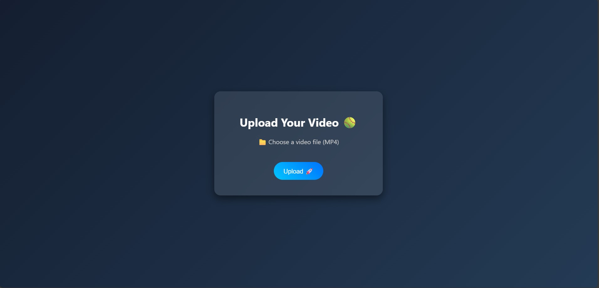
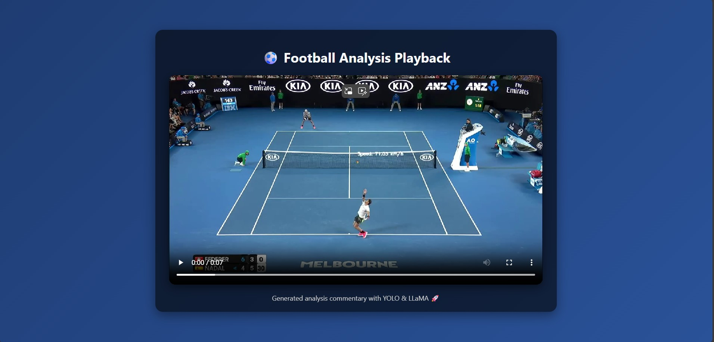

# 🎾 Real-Time Sports Commentary Generation with YOLOv8 and LLaMA2  

This project was developed as part of my **capstone project**, where the primary use case was **small object detection**, specifically tracking tennis balls during tennis matches.  

Tennis balls often appear **very small, blurry, and fast-moving** within broad environments, making them challenging to detect and analyze. My objective was to:  

- **Accurately detect tennis balls across video frames** using a modified YOLOv8 model.  
- **Measure the speed of the ball** by calculating motion from detection coordinates.  
- **Leverage LLaMA2 as a sports analyst**, analyzing ball speeds and generating automated commentary every 2 seconds, displayed as **subtitles during the match**.

### Home Page


### Results Page


---

## ✨ Key Features  

- **Custom Tennis Dataset**  
  Built a specialized dataset by annotating tennis balls in match videos using **Roboflow**, ensuring high-quality training data for YOLOv8.  

- **Optimized Small Object Detection**  
  Enhanced YOLOv8 with an additional convolutional head layer (**3×3 kernel**) for accurate detection of very small objects, even as small as **4×4 pixels**.  

- **Smart Misclassification Handling**  
  Integrated a custom loss function with a **deviation penalty factor (0.7)** to reduce false detections, avoiding confusion between tennis balls and players’ white jerseys.  

- **High Detection Accuracy**  
  Achieved a **91% Mean Average Precision (mAP)**, demonstrating strong performance in detecting small, fast-moving tennis balls.  

- **Real-Time Ball Speed Tracking**  
  Calculated ball speed using detection coordinates and pixel data to provide precise **trajectory and movement analysis**.  

- **AI-Powered Commentary Generation**  
  Combined ball speed data with **LLaMA2 (3.3B parameters)** to generate **context-aware commentary every 2 seconds**, automatically displayed as **subtitles during the match**.  

---

## 📦 Requirements  

Install dependencies with:  

```bash
pip install -r requirements.txt
```  

Set up your environment variables by adding your **Groq API key** to a `config.json` file:  

```json
{
  "GROQ_API_KEY": "your-groq-api-key"
}
```  

---

## 🚀 How to Run  

1. Clone this repository:  
   ```bash
   git clone https://github.com/tajish/Real-Time-Sports-Commentary-Generation-with-YOLOv8-and-LLaMA2.git
   cd your-repo-name
   ```  

2. Install dependencies:  
   ```bash
   pip install -r requirements.txt
   ```  

3. Add your API keys to `config.json`.  

4. Run the Flask app:  
   ```bash
   python main.py
   ```  

5. Open your browser and go to:  
   ```
   http://127.0.0.1:5000/
   ```  
   Upload your tennis match video 🎾 → The app will detect the ball and generate **real-time commentary subtitles**.  

---

## 📂 Project Structure  

```
├── app.py              # Main Flask application  
├── Tennis_detection/   # YOLOv8 customization & fine-tuning scripts  
├── config.py           # Configuration handler (API keys, etc.)  
├── LlamaExpert.py      # Loads LLaMA2 (3.3B) & generates commentary  
├── templates/          # Frontend HTML templates  
├── requirements.txt    # Dependencies  
└── README.md           # Project documentation  
```  

---

## 📝 Notes  

- This is a **learning project**, so the code may not be perfect but it’s fully functional 🎯.  
- Contributions, suggestions, and improvements are very welcome 🙌.  

Have fun trying it out, and feel free to fork/modify this project! 🎉  
